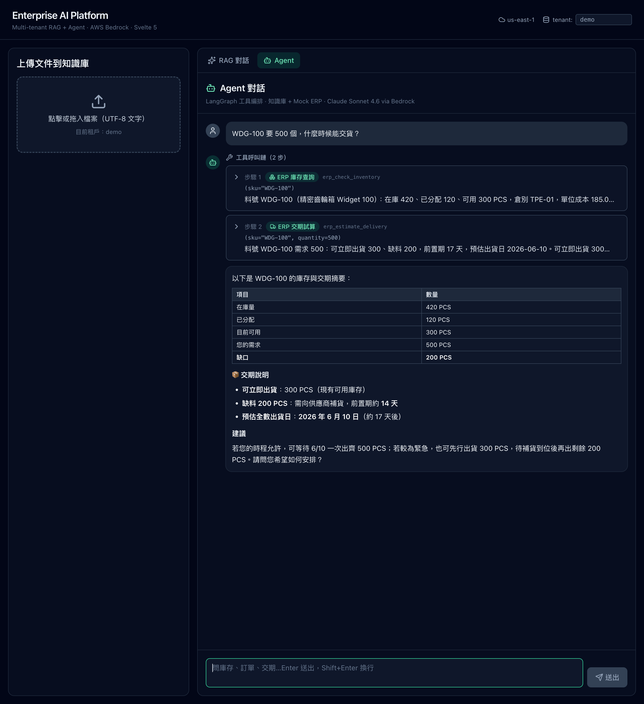
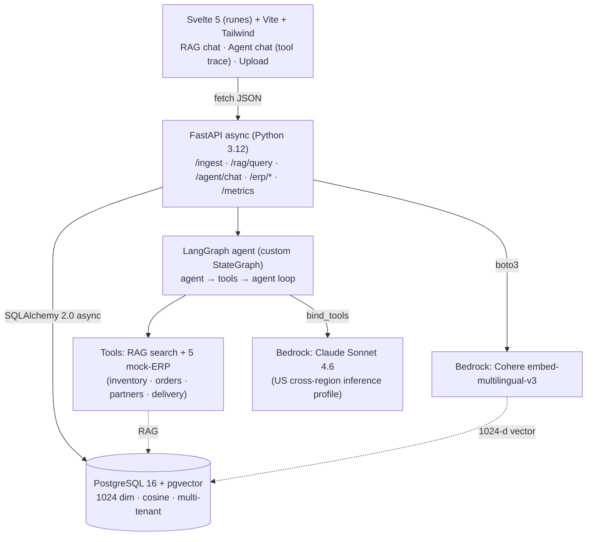
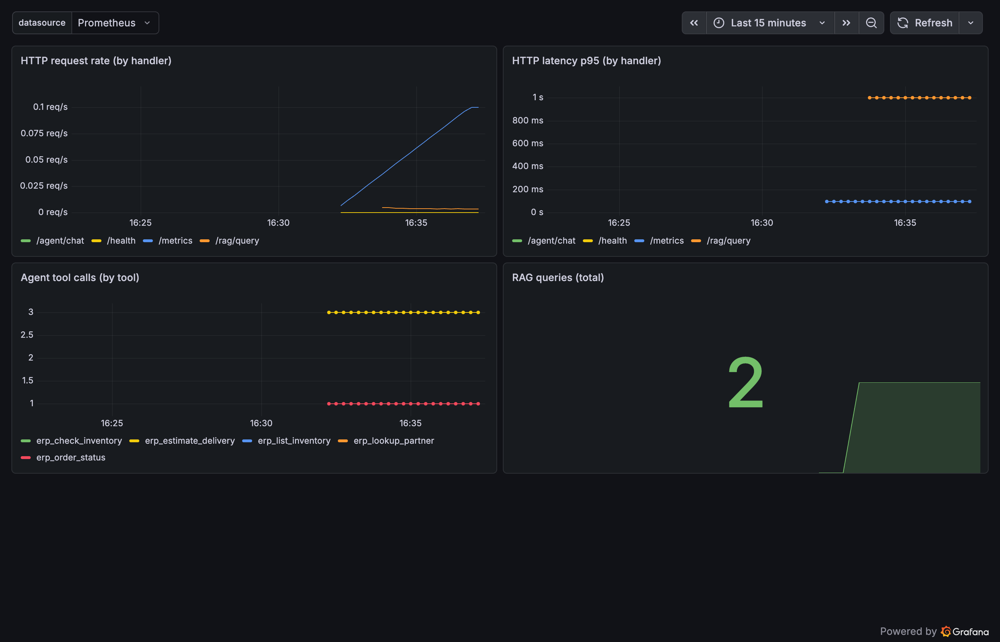
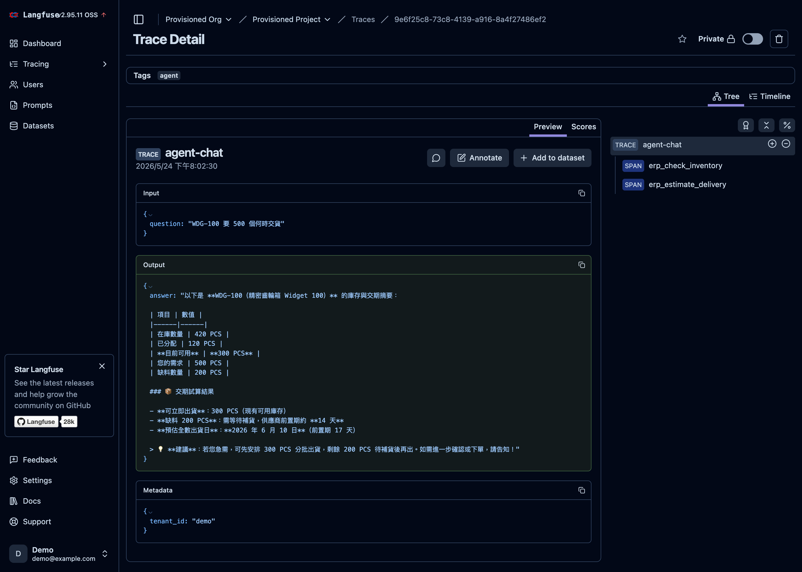

# Enterprise AI Platform — Showcase

> **Multi-tenant RAG + Agent platform built 100% on AWS Bedrock** — Cohere `embed-multilingual-v3` for embeddings, Claude Sonnet 4.6 for generation, a LangGraph tool-calling agent over RAG + mock-ERP tools, FastAPI + pgvector backend, Svelte 5 frontend, packaged as a Helm chart with Prometheus/Grafana observability, fronted by a Kong API gateway and traced with LangFuse.
>
> Built by a CTO with **22+ years of enterprise systems** (SAP / Epicor / Tiptop ERP + BI) — practical AI engineering grounded in real production constraints, not toy demos.

---

> ## 🔒 This is a showcase repository
>
> Architecture, decisions, demo, and tech writeup are public here.
> **Full source code lives in a private repository** — recruiters can request read access by emailing **[hugopeng@gmail.com](mailto:hugopeng@gmail.com)** with their GitHub username.

---

## 🎬 Demo

> 30-second walkthrough — upload README → ask in Traditional Chinese → get source-cited answer.

**RAG test cases the system handles correctly**:

- 🟢 「這個專案用什麼向量資料庫？」 → factual retrieval with source citation
- 🟡 「為什麼選 AWS Bedrock 而不直接用 Anthropic？」 → multi-source inference
- 🔵 「跑一次 demo 大概要花多少錢？」 → cost calculation from README
- ⚠️ 「今天台北天氣如何？」 → out-of-scope → system declines instead of hallucinating

### 🤖 Agent (Week 2)

A **LangGraph agent** decides which tool to call — RAG knowledge-base search or one of five mock-ERP tools — and **chains them for multi-step reasoning**. Every response includes an **auditable tool trace**.

- 「WDG-100 要 500 個，什麼時候能交貨？」 → agent calls `erp_check_inventory` **then** `erp_estimate_delivery`, and summarizes stock + delivery date
- 「現在有哪些料號？」 → routes to `erp_list_inventory` (structured ERP data, not the knowledge base)
- 「今天台北天氣如何？」 → out-of-scope → declines without calling any tool

> Hard guardrails live in the harness (tool allow-list, tenant isolation, recursion cap), not just the prompt.

_The agent chained `erp_check_inventory` → `erp_estimate_delivery` and rendered a stock + delivery summary — the tool trace above the answer is fully auditable._

---

## 🎯 What & Why

After 22+ years deploying SAP, Epicor and Tiptop ERP across manufacturing and consulting, I keep seeing the same pattern when companies try to "do AI":

1. Each BU spins up its own LLM service — wasted spend, fractured governance
2. Prompts and pipelines scatter across projects — change one thing, break five others
3. Real AI value comes from integrating with ERP / MES / BI data flows, not from sticking a chatbot on top

**Enterprise AI Platform** is the reference architecture I built to address exactly that — a multi-tenant RAG service where every BU shares one infrastructure, all LLM traffic goes through a single AWS Bedrock IAM key, and source-cited answers ground the AI in actual documents (not hallucinations).

This is the kind of system I would deploy on day one if asked to lead AI integration at a manufacturing or ERP-heavy organization.

---

## 🏗️ Architecture

**Deployment & ops:** packaged as a single **Helm chart** (backend + frontend + in-cluster pgvector); **Prometheus** scrapes `/metrics` via a `ServiceMonitor`, and a **Grafana** dashboard auto-imports (verified on minikube + kube-prometheus-stack). A **Kong** API gateway (DB-less) fronts the backend with API-key auth + rate limiting, and **LangFuse** traces every agent run.

---

## ✨ Key Features

- 🔁 **Asymmetric Retrieval** — Cohere `search_document` (ingest) vs `search_query` (retrieval). Higher accuracy than symmetric embeddings on multilingual content.
- 🌐 **Cross-region Inference Profile** — `us.anthropic.claude-sonnet-4-6` auto-fails over across US regions. No extra cost, no manual fallback code.
- 🏢 **Multi-tenant** — Every chunk carries `tenant_id`. Designed for the real enterprise case of one shared service across BUs.
- 🔐 **Single IAM key** — One `AWS_BEARER_TOKEN_BEDROCK` covers both Cohere + Claude. One bill, one audit trail.
- 📚 **Source-cited answers** — Claude responses include `[1][2]` citations + collapsible source cards. Validated against "out-of-scope" prompts to prevent hallucination.
- 🤖 **Tool-calling agent** — Custom LangGraph `StateGraph` routes between RAG and five mock-ERP tools, chains them for multi-step reasoning (stock → delivery date), and returns an auditable `tool_trace`.
- 🏭 **Mock ERP integration** — Deterministic SAP-style data (inventory, SO/PO, customer/supplier master, delivery estimation) exposed as a webhook and consumed by the agent — the ERP × AI story, not a bare chatbot.
- ☸️ **Kubernetes-ready** — One Helm chart for the whole stack (backend, frontend, in-cluster pgvector StatefulSet), verified on minikube.
- 📈 **Observability** — Prometheus `/metrics` with custom `agent_tool_calls_total{tool}` + auto-imported Grafana dashboard.
- 🛡️ **API gateway** — Kong (DB-less) fronts the backend with API-key auth + rate limiting; the policy is one declarative file (verifiable: 401 / 200 / 429).
- 🔍 **LLM tracing** — LangFuse records each agent run's tool-call chain (question → tools → answer); optional and graceful.
- 🐳 **Production scaffolding** — Multi-stage Dockerfiles, docker-compose for local pgvector, GitHub Actions CI (lint + tests + image build smoke).

---

## 🛠️ Tech Stack

| Layer | Choice | Why |
| --- | --- | --- |
| **Frontend** | Svelte 5 (runes) + Vite + Tailwind | Small bundle, no SSR overhead, runes for clean state |
| **Backend** | FastAPI + SQLAlchemy 2.0 async | Async friendly for LLM-long-tail latency, OpenAPI baked in |
| **Vector DB** | pgvector + cosine distance | Join with metadata in the same transaction, no extra ops |
| **Embedding** | Cohere `embed-multilingual-v3` via Bedrock | 100+ languages, leading Traditional Chinese quality |
| **Generation** | Claude Sonnet 4.6 (US cross-region IP) via Bedrock | Top-tier Chinese reasoning, AWS-governed billing |
| **Async Bedrock** | `boto3` + `asyncio.to_thread` | Avoids pulling in `aioboto3` dependency tree |
| **Chunking** | LangChain RecursiveCharacterTextSplitter | Chinese punctuation aware split points |
| **Agent** | LangGraph custom `StateGraph` + `langchain-aws` | Explicit tool-calling loop, auditable trace |
| **Orchestration** | Kubernetes + Helm chart | Whole stack, one `helm install` |
| **Observability** | Prometheus + Grafana (kube-prometheus-stack) | `/metrics` + custom agent/RAG metrics |
| **API Gateway** | Kong (DB-less, declarative) | API-key auth + rate limiting, config as code |
| **LLM Tracing** | LangFuse (self-hosted) | Per-run agent trace: question → tools → answer |
| **Package mgmt** | `uv` (backend) + `pnpm` (frontend) | Fastest installs, smallest on-disk footprint |
| **Container** | Docker multi-stage (builder + runtime) | ~250 MB backend, ~50 MB nginx frontend |
| **CI** | GitHub Actions (lint + test + docker smoke) | Three parallel jobs |

---

## 🧠 Design Decisions (ADR Summaries)

The private repo contains 9 full Architecture Decision Records following Michael Nygard's format. Summaries:

### ADR-001: Use AWS Bedrock instead of direct Anthropic API

Single IAM key for both Cohere + Claude, monthly AWS billing (vs prepaid Stripe), cross-region inference profile for free HA, AWS-native plumbing (S3 / CloudWatch / Budgets). Bypasses Taiwan-specific Stripe / VAT friction. Trade-off: one-time use-case form on first Anthropic invocation.

### ADR-002: Cohere `embed-multilingual-v3` over Amazon Titan

Leading multilingual quality on Traditional Chinese, first-class asymmetric retrieval API (`search_document` vs `search_query`), 1024-dim sweet spot. 5× the unit cost of Titan v2 is acceptable for the quality gap.

### ADR-003: Claude Sonnet 4.6 over Opus for RAG

RAG generation is "synthesize from supplied context" — Sonnet handles it cleanly at 5× lower cost and 2× faster than Opus. Opus's edge is novel reasoning, which RAG doesn't need. Cost-aware model selection is itself a senior engineering signal.

### ADR-004: pgvector over Pinecone / Qdrant

One stateful system instead of two — vector lives in the same Postgres as metadata, `JOIN` in one transaction, multi-tenant via `WHERE tenant_id = …`. Pinecone's $70+/month adds vendor + bill + network hop without proportional benefit at this scale (< 10M vectors).

### ADR-005: Vanilla Vite + Svelte 5 over SvelteKit

Single-page chat UI has no SSR / file-based routing / per-route data needs. Vanilla Vite produces a pure static SPA that's trivial to mount into FastAPI later. Cuts framework surface in half without sacrificing reactivity.

### ADR-006: Hand-built LangGraph `StateGraph` over prebuilt `create_react_agent`

The explicit `agent → tools → agent` loop with a `tools_condition` edge and recursion cap makes the control flow self-documenting and leaves clean seams for enterprise concerns (approval gates, guardrails, auditable tool traces). Depends only on stable `StateGraph` / `ToolNode` primitives, not a churning prebuilt helper.

### ADR-007: In-cluster pgvector (StatefulSet) over a managed DB for the Helm chart

Self-contained `helm install` on bare minikube (no cloud account for the demo) and demonstrates stateful-workload competence (StatefulSet + PVC + readiness probe). Managed Postgres is documented as the production swap (override `DATABASE_URL`).

### ADR-008: Kong DB-less (declarative) as the API gateway

Gateway policy lives in one version-controlled `kong.yml` (no gateway database), verifiable in three curls (401 / 200 / 429) and clean for GitOps. Kong Ingress Controller and DB-backed Kong were considered but add machinery without demo benefit.

### ADR-009: Self-hosted LangFuse v2 with low-level instrumentation

Postgres-only self-host (avoids the heavy v3 ClickHouse stack) for a real, reproducible trace. Instruments with the low-level LangFuse client rather than the LangChain handler, sidestepping a v2-handler-needs-old-langchain version conflict. Tracing is optional and graceful; LangFuse Cloud + the v4 SDK is the documented production swap.

---

## 📊 Performance (local test environment, single-run observed)

> _Numbers are from manual smoke tests on a local Mac. Not production benchmarks._

| Metric | Value | Notes |
| --- | --- | --- |
| Embedding latency | ~150 ms | Cohere multilingual v3, batch of 6 chunks |
| RAG P50 latency | ~1.8 s | top_k = 3, Sonnet 4.6 |
| RAG P95 latency | ~3.5 s | with full source content rendered |
| Docker image size | ~250 MB | multi-stage, Python slim |
| Bedrock cold start | ~6 s | first invocation only |

---

## 💰 Cost (per demo run)

| Item | Unit price | Demo usage | Cost |
| --- | --- | --- | --- |
| Cohere embed | $0.10 / 1M tokens | 50K tokens | $0.005 |
| Claude Sonnet input | $3 / 1M tokens | 10K tokens | $0.03 |
| Claude Sonnet output | $15 / 1M tokens | 5K tokens | $0.08 |
| **Total per demo run** | | | **< $0.20** |

AWS monthly billing — no Stripe prepay, no VAT validation friction.

---

## 🗺️ Roadmap

| Week | Scope | Status |
| --- | --- | --- |
| **1** | RAG core (ingest + query + Svelte 5 UI) | ✅ |
| **2** | LangGraph Agent + tool calling + mock ERP webhook | ✅ |
| **3** | Helm Chart + K8s deployment + Prometheus monitoring | ✅ |
| **4** | Kong API Gateway + LangFuse tracing + ADR catalog | ✅ |

---

## 👤 About the Author

**Hugo Peng** — CTO at an EdTech company, MBA, with **22+ years across the dominant ERP ecosystems in Greater China**:

| Years | Role | Stack |
| --- | --- | --- |
| 2025 – now | **CTO** @ EdTech company (current) | AI strategy + engineering |
| 2018 – 2025 | **Consultant → CIO → CTO** @ itelligensys | Epicor ERP consulting and platform leadership |
| 2015 – 2017 | Senior Engineer @ Vivotek | SAP ERP (PP / MM / PM / QM / SD / BI) |
| 2010 – 2014 | SAP ERP PP + BI Leader @ TSMT | SAP module ownership + BI team lead |
| 2006 – 2010 | ERP / BI Specialist @ DragonJet | Tiptop ERP |
| 2004 – 2006 | ERP Logistics Specialist @ Rossmax | Tiptop ERP |

### 🛠️ Full-stack range

- **Backend**: Python 3.12, FastAPI, SQLAlchemy 2.0 async
- **Enterprise systems**: 22+ years across SAP, Epicor, Tiptop ERP + BI
- **Frontend Web**: Svelte 5 (runes), TypeScript, Tailwind
- **Mobile**: Flutter (iOS + Android, including production app deployments)
- **Data**: pgvector, PostgreSQL, BI ecosystems
- **Cloud / AI**: AWS Bedrock (Anthropic + Cohere), IAM, multi-tenant patterns
- **Leadership**: MBA, multiple-year CTO / CIO tenure, BI team lead

### 🎯 What I bring that most AI engineers can't

- **Real ERP scar tissue** — When AI integration discussions hit SAP / MES / supply chain, I ground them in actual data models, not generic abstractions
- **Three-platform ERP exposure** (SAP / Epicor / Tiptop) — Rare combination, especially valuable for Taiwanese / Greater China manufacturing
- **Cost / governance reflex** — Years of being on the receiving end of "the AI demo that never shipped" makes my AI work boringly production-ready

### 🤝 Open to

- AI Solution Architect
- AI Engineering Lead / Manager
- Director of AI
- AI Pre-sales Architect

Especially in roles where **enterprise system integration and AI engineering need the same person in the room**.

---

## 📂 Source Code Access

The complete implementation lives in a **private GitHub repository** containing:

- Full backend (FastAPI app, services, models, routers, LangGraph agent + tools, mock ERP)
- Full frontend (Svelte 5 — RAG + Agent tabs with tool-trace visualization)
- Complete ADRs (7 documents, Michael Nygard format)
- Helm chart (backend + frontend + pgvector + Prometheus ServiceMonitor + Grafana dashboard)
- Kong API gateway config + LangFuse tracing integration (Week 4)
- Dockerfiles, GitHub Actions CI, deployment guides, E2E smoke script
- Test suite (RAG, agent, ERP, metrics)

For recruiters and hiring managers:

- 📧 Email **[hugopeng@gmail.com](mailto:hugopeng@gmail.com)** with your GitHub username — I'll add you as a read-only collaborator
- 💼 [LinkedIn — Hugo Peng](https://www.linkedin.com/in/hugopeng/)
- 📁 GitHub profile: [github.com/hugopeng](https://github.com/hugopeng)

---

## 📜 License

The showcase content (this README, diagrams, demo gif) is published under MIT for portfolio purposes. See [LICENSE](LICENSE).
